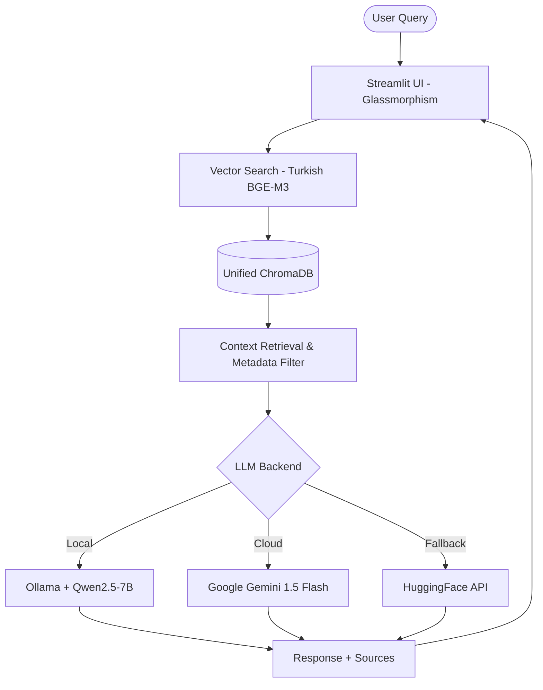

# 🇹🇷 Turkish Government Intelligence Hub

**A Professional, Production-Ready RAG System for Analyzing Turkish Political Party Constitutions with Qwen2.5**

[](#)
[](https://www.python.org/downloads/)
[](https://www.langchain.com/)
[](https://streamlit.io/)
[](Dockerfile)
[](https://github.com/barancanercan/Turkish-Government-Intelligence-Hub/actions)
[](LICENSE)

---

## 🌐 Live Demo & Experience

🚀 **Access the App:** [turkish-government-intelligence-app.streamlit.app](https://turkish-government-intelligence-app.streamlit.app/)

_Engage in natural language conversations with the official constitutions of 8 major Turkish political parties, utilizing state-of-the-art local and cloud-based LLMs._

---

## 🎯 Key Features (v4.1+)

### 🧠 Advanced RAG Engine

- **Unified Vector Database:** All party data consolidated into a single, high-performance ChromaDB collection with metadata filtering.
- **Turkish BGE-M3 Embeddings:** Specifically optimized for the Turkish language to ensure maximum retrieval accuracy.
- **Source Attribution:** Every response includes direct references to the PDF pages and exact text quotes for 100% transparency.
- **Intelligent Caching:** Vectorstore and embeddings cached for optimal performance.

### 🎭 Modern & Intelligence-Grade UI

- **Glassmorphism Design:** A premium, semi-transparent interface with smooth animations and responsive layout.
- **Comparative Analysis:** Side-by-side comparison mode to analyze multiple parties' stances on a single issue simultaneously.
- **Interactive Dashboard:** Real-time statistics on total knowledge base chunks and system status.

### 🔌 Flexible LLM Backend

- **Hybrid LLM Support:** Seamlessly switches between:
  - **Local Ollama (Qwen2.5-7B)** - Default, best for privacy
  - **Google Gemini 1.5 Flash** - Cloud option for better reasoning
  - **HuggingFace Inference API** - Fallback option
- **Lazy Loading Strategy:** Resources (Vector DB, Models) only load when needed, optimizing startup and memory usage.
- **Hash-Based Tracking:** Intelligent data preparation that only processes modified PDF files after hashing.

### 🛠️ Modular Architecture

- **Core Utilities:** Reusable modules in `src/core/`:
  - `parties.py` - Turkish party name normalization (İYİ, CHP, etc.)
  - `streaming.py` - Unified stream response handling
  - `llm_setup.py` - LLM initialization with fallback chain
  - `cache.py` - Vectorstore caching utilities

---

## 🏗️ Technical Architecture



---

## 📊 Analytics & Coverage

| Party      | Constitution Pages | Vector Chunks | AI Readiness |
| :--------- | :----------------: | :-----------: | :----------: |
| 🔴 **CHP** |        140         |     328       |   ✅ 100%    |
| 🟠 **AKP** |        144         |     466       |   ✅ 100%    |
| 🔵 **MHP** |        152         |     377       |   ✅ 100%    |
| 🟡 **İYİ** |         54         |     334       |   ✅ 100%    |
| 🟣 **DEM** |         36         |     121       |   ✅ 100%    |
| 🟢 **SP**  |         25         |     164       |   ✅ 100%    |
| ⚫ **ZP**  |         46         |     268       |   ✅ 100%    |
| 🔴 **BBP** |         58         |     151       |   ✅ 100%    |

---

## 🚀 Getting Started

### 1. Local Setup (Ollama - Recommended)

The recommended way for maximum privacy and performance.

```bash
# Pull the Turkish-optimized model
ollama pull qwen2.5:7b-instruct

# Clone and install
git clone https://github.com/barancanercan/Turkish-Government-Intelligence-Hub.git
cd Turkish-Government-Intelligence-Hub

# Create virtual environment (Windows)
python -m venv .venv
.venv\Scripts\Activate.ps1

# Install dependencies
pip install -r requirements.txt

# Prepare vector database (one-time setup)
python src/prepare_data.py --force

# Run the UI
streamlit run src/app.py
```

### 2. Cloud Setup (Gemini API)

For better reasoning capabilities, configure Google Gemini:

```bash
# Create .env file with your API key
echo "GEMINI_API_KEY=your_api_key_here" > .env
```

### 3. Docker Execution

```bash
docker build -t intelligence-hub .
docker run -p 8501:8501 intelligence-hub
```

---

## 📂 Project Organization

```text
├── .github/workflows/      # CI/CD (GitHub Actions)
├── data/pdfs/              # Official Constitution PDFs
├── src/                    # Core source code
│   ├── app.py             # Streamlit Glassmorphism UI
│   ├── query_system.py    # RAG logic & LLM Handlers
│   ├── config.py          # Configuration & Party Info
│   ├── utils.py           # VectorDB & Text Processing
│   ├── prepare_data.py    # Hash-based DB preparation
│   ├── core/              # Modular utilities
│   │   ├── parties.py     # Party name normalization
│   │   ├── streaming.py  # Stream response handling
│   │   ├── llm_setup.py   # LLM initialization
│   │   └── cache.py       # Caching utilities
│   ├── exceptions.py      # Custom exception classes
│   └── models.py          # Pydantic models
├── tests/                 # Pytest suite (Unit & Integration)
├── scripts/               # Database backup & maintenance
├── vector_db/             # ChromaDB vector databases
├── Dockerfile             # Containerization
├── requirements.txt       # Production dependencies
└── .env                   # Environment variables (API keys)
```

---

## 🧪 Testing & Quality

We maintain high coding standards via professional tools:

- **Linting:** `ruff check .`
- **Formatting:** `black .`
- **Tests:** `pytest tests/`

You can verify the system locally with:

```bash
pytest
```

---

## 🤝 Contributing & Vision

> **"Open Data. Open Democracy. Powered by AI."**

This project aims to democratize access to political information in Türkiye. We welcome contributions for:

- 🌐 Adding new political party constitutions.
- 🎨 UI/UX improvements.
- 🚀 Query performance optimizations.

---

## 📝 License & Authors

Distributed under the **MIT License**. See `LICENSE` for more information.

Developed with ❤️ by **Baran Can Ercan**

- 💼 [LinkedIn](https://linkedin.com/in/barancanercan)
- ✍️ [Medium](https://barancanercan.medium.com)
- 🐙 [GitHub](https://github.com/barancanercan)

---

<div align="center">
  <b>Turkish Government Intelligence Hub</b><br>
  Made for transparency, efficiency, and civic intelligence. 🇹🇷
</div>
